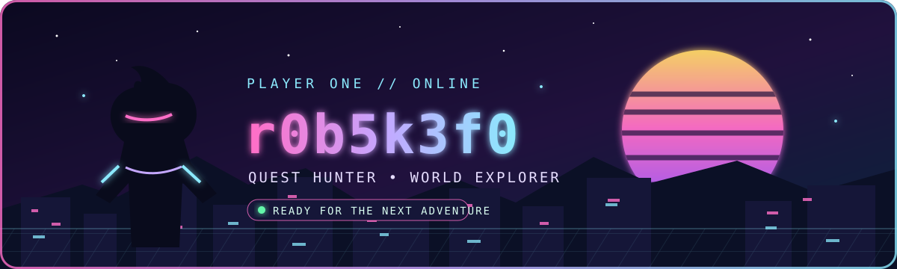

<!--
  GitHub Profile README for @r0b5k3f0
  Edit the Current Quests section whenever your interests change.
-->

<div align="center">
  
</div>

<div align="center">
  <a href="https://git.io/typing-svg">
    
  </a>
</div>

<p align="center">
  
  
  
</p>

---

## 🎮 Player Profile｜玩家檔案

```yaml
handle: r0b5k3f0
class: Quest Hunter
alignment: Chaotic Curious
current_zone: Somewhere between reality and the next save point
party_role: Explorer / Collector / Theorycrafter
favorite_loot: Hidden quests, rare rewards, and unforgettable stories
status: "One more quest..."
```

> **EN** — A player who enjoys discovering new worlds, digging into game systems, and tracking down things that are easy to miss.
>
> **中文** — 喜歡探索新世界、研究遊戲機制，以及尋找那些一不留神就會錯過的隱藏內容。

## 🗺️ Current Quests｜目前任務

<table>
  <tr>
    <td width="50%" valign="top">
      <h3>⚔️ Main Quest</h3>
      <b>Arknights: Endfield</b><br/>
      Exploring Talos-II, following future Operators, and planning every pull like a strategy mission.<br/><br/>
      <sub>探索塔衛二、追蹤未來幹員，並像規劃作戰一樣安排每一次抽卡。</sub>
    </td>
    <td width="50%" valign="top">
      <h3>🔮 Side Quest</h3>
      <b>Discord Quest Hunting</b><br/>
      Tracking regional campaigns, limited rewards, and quests hidden outside the usual tab.<br/><br/>
      <sub>追蹤區域限定活動、限時獎勵，以及不會出現在一般任務頁面的隱藏 Quest。</sub>
    </td>
  </tr>
</table>

## 🧭 Adventure Log｜冒險偏好

<p align="center">
  
  
  
  
  
</p>

- 🌌 **Worlds:** science fiction, fantasy, post-apocalyptic settings
- 🧠 **Systems:** team building, theorycrafting, resource planning
- 🏆 **Collecting:** limited rewards, achievements, cosmetics
- 🔍 **Discovery:** obscure mechanics, regional events, hidden details
- 🎲 **Playstyle:** curious first, optimized later

## 📊 Character Stats｜角色數據

<div align="center">
  <picture>
    <source media="(prefers-color-scheme: dark)" srcset="https://github-readme-stats.vercel.app/api?username=r0b5k3f0&show_icons=true&hide_border=true&bg_color=0D1117&title_color=FF6EC7&icon_color=8BE9FD&text_color=E6EDF3&ring_color=C4A7FF" />
    
  </picture>
  <picture>
    <source media="(prefers-color-scheme: dark)" srcset="https://github-readme-streak-stats.herokuapp.com?user=r0b5k3f0&hide_border=true&background=0D1117&ring=FF6EC7&fire=FFD866&currStreakLabel=8BE9FD&sideLabels=C4A7FF&dates=7D8590&currStreakNum=E6EDF3&sideNums=E6EDF3" />
    
  </picture>
</div>

<div align="center">
  
</div>

## 🐍 Activity Trail｜活動軌跡

<div align="center">
  <picture>
    <source media="(prefers-color-scheme: dark)" srcset="https://raw.githubusercontent.com/r0b5k3f0/r0b5k3f0/output/github-contribution-grid-snake-dark.svg" />
    
  </picture>
</div>

> The snake appears after the included GitHub Action runs for the first time. If Actions are disabled, enable them under **Settings → Actions → General**.

## 💾 Save Point｜聯絡與收藏

<p align="center">
  <a href="https://github.com/r0b5k3f0?tab=repositories">
    
  </a>
  <a href="https://github.com/r0b5k3f0?tab=stars">
    
  </a>
</p>

<div align="center">
  
  <br/>
  <sub>「下一個存檔點就在前方。」— The next save point is just ahead.</sub>
  <br/><br/>
  
</div>
